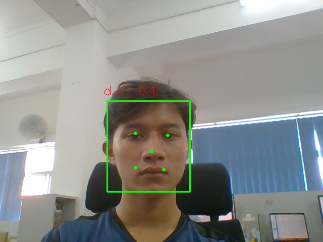

# facial_attendance_gui
facial attendance with YuNet and LBPs using python design by PyQt5

Các chức năng chính của ứng dụng bao gồm:

  -Đăng nhập và đăng xuất
  
  -Đăng kí thành viên
  
  -Thực hiện điểm danh bằng nhận diện khuôn mặt
  
  -Xem báo cáo điểm danh

Result : 

Repost : 

